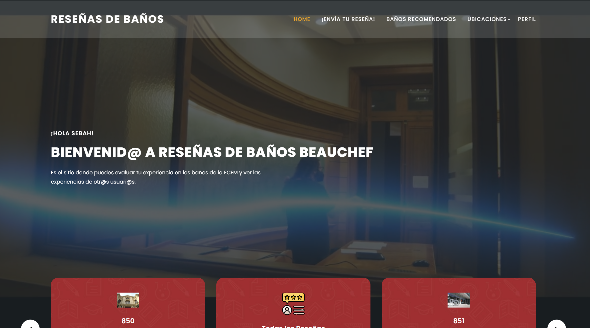
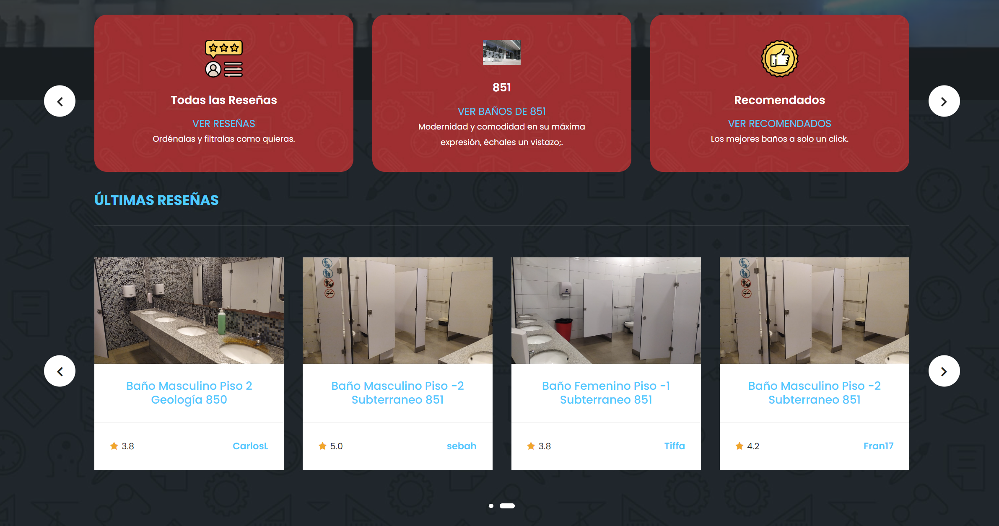
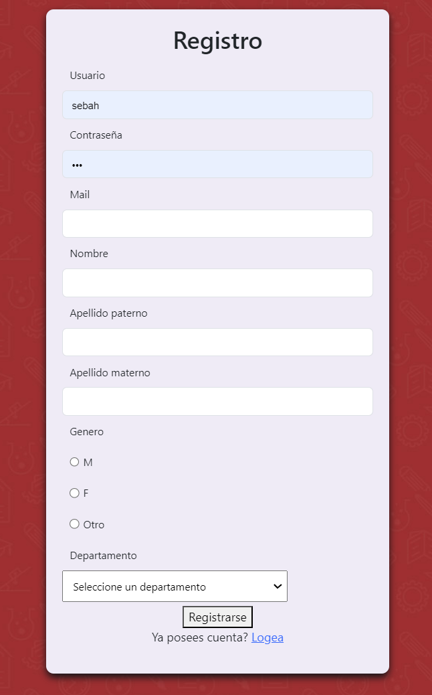
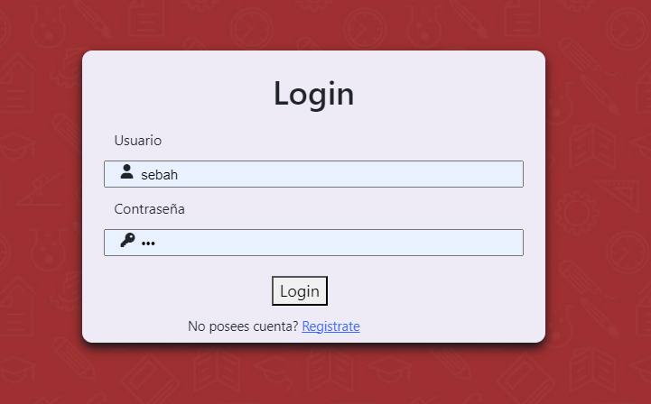
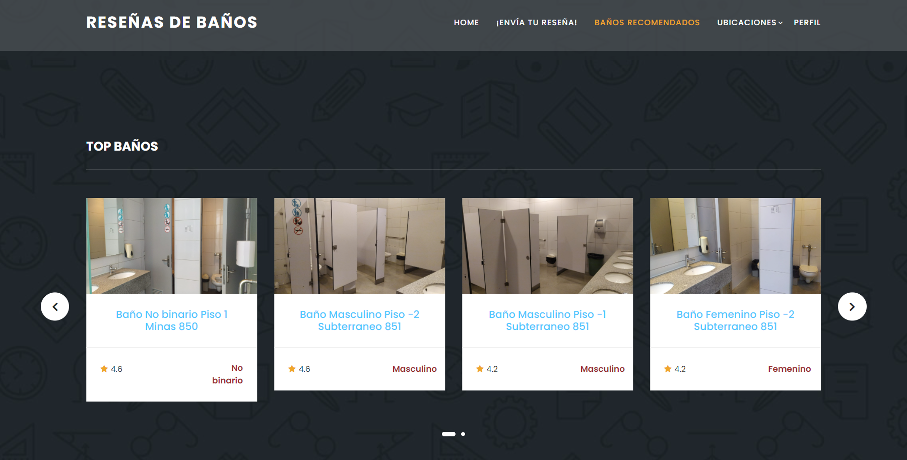
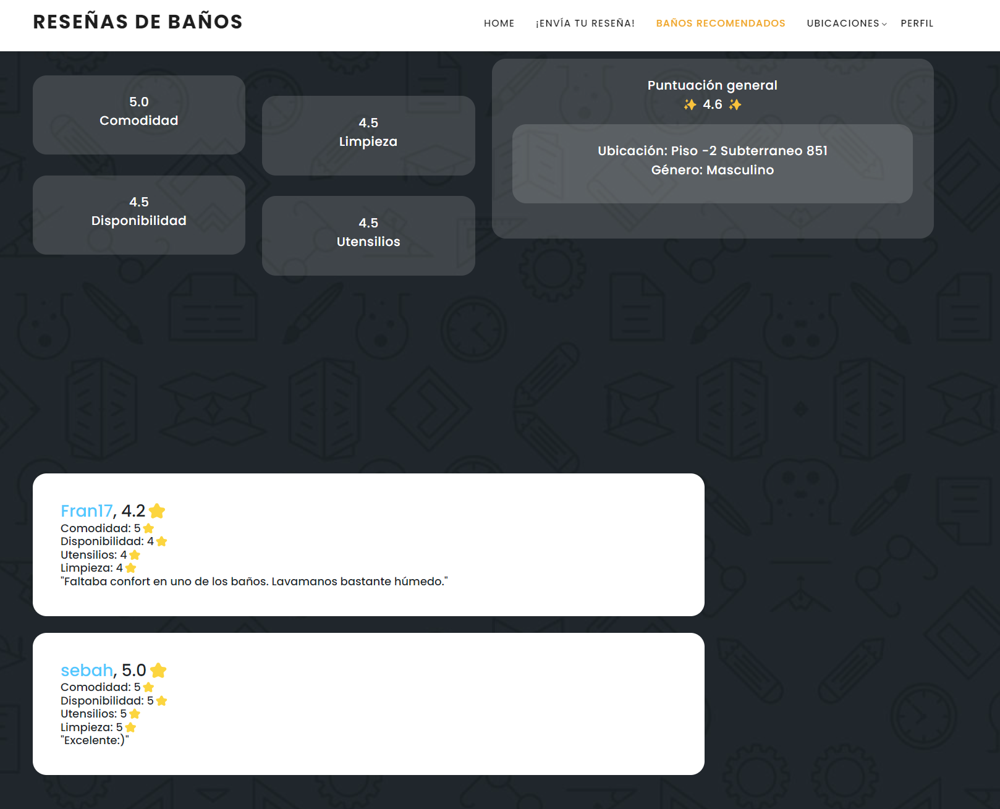
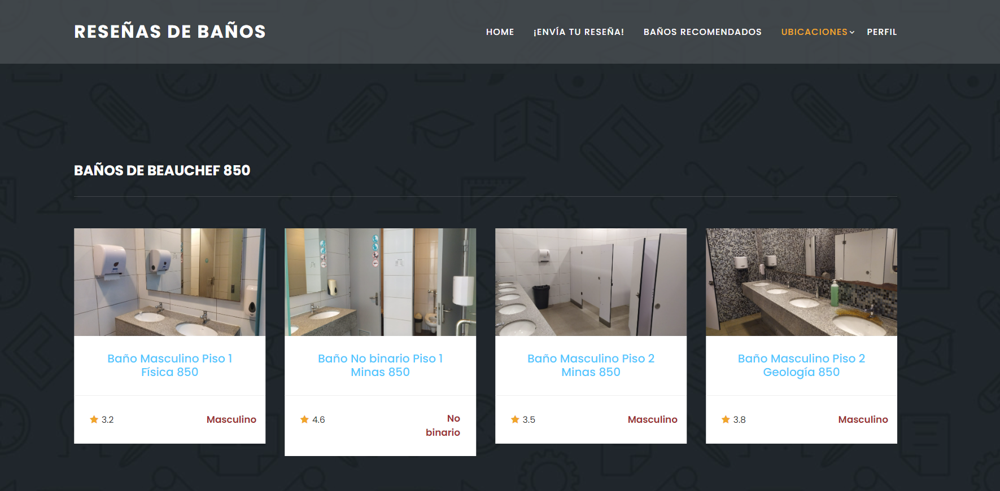
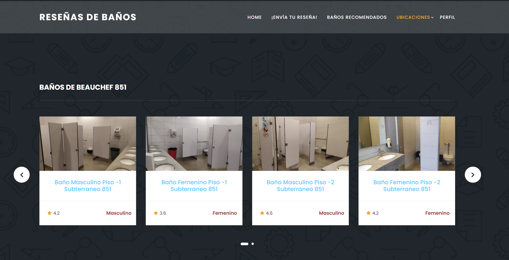
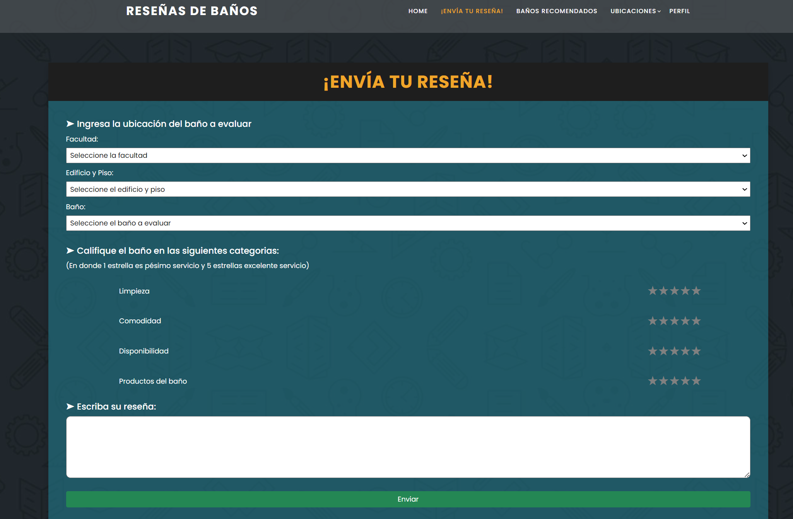
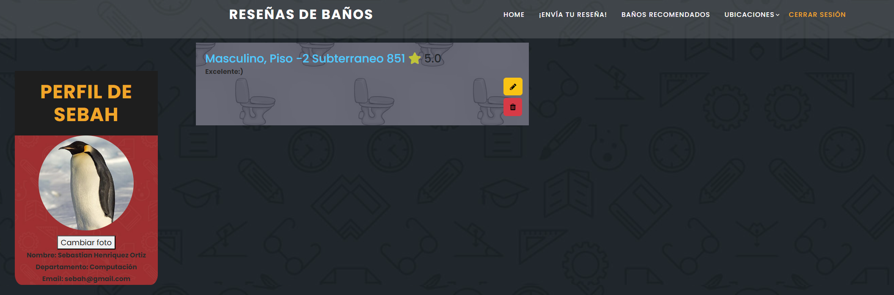

# Proyecto Baños de Beauchef - Grupo 01

El proyecto llevado a cabo es una aplicación web de reseñas de los baños de la
FCFM. Las reseñas a los baños tienen puntuaciones de 1 a 5 estrellas de distintos aspectos,
una puntuación general y observaciones que se quieran agregar. Los aspectos considerados
para las reseñas son el nivel de limpieza del baño, la existencia de utensilios como papel
higiénico o jabón, la disponibilidad del baño y la comodidad de este. A cada reseña se le
puede agregar un comentario y dar “me gusta” o “no me gusta”. Los usuarios pueden editar
sus reseñas en cualquier momento, así como también borrarlas.

##  Descargar e Instalar banos_beauchef

1.  Lo primero es hacer Fork y Clone de este mismo repositorio.
2.  Para entrar a la carpeta donde está el proyecto hay que hacer `cd 2023-1-Grupo-1` en la consola.
3. Para poder utilizar esta app hay que instalar los paquetes que el proyecto requiere.
Para esto instalaremos la lista de paquetes que viene en el archivo `requirements.txt` con el siguiente comando (RECUERDA TENER EL AMBIENTE VIRTUAL ACTIVO):
 ```
 (myvenv) pip install -r requirements.txt
 ```

## Uso de la aplicación

Una vez configurado el proyecto en tu computador, deberías poder acceder a la aplicación web con el siguiente comando:
 ```
 (myvenv) python manage.py runserver
 ```   

Al estar en desarrollo aún no es posible navegar libremente por la aplicación, pero sí acceder a los distintos HTML's.

1. Home: `http://127.0.0.1:8000/home/`, se debería mostrar:   

2. Registro de usuario:  `http://127.0.0.1:8000/register/`, se debería mostrar: 

3. Inicio de sesión de usuario:  `http://127.0.0.1:8000/login/`, se debería mostrar: 

4. Baños recomendados: `http://127.0.0.1:8000/recommendedBannos/`, se debería mostrar: 

5. Perfil del Baño de id **pk**: `http://127.0.0.1:8000/bannoProfile/pk/`, se debería mostrar: 

6. Baños 850: `http://127.0.0.1:8000/850/`, se debería mostrar: 

7. Baños 851: `http://127.0.0.1:8000/851/`, se debería mostrar: 

8. Enviar Reseña: `http://127.0.0.1:8000/add_resenna/`, se debería mostrar: 

9. Ver reseñas: `http://127.0.0.1:8000/recientes_resennas/`, se debería mostrar: 

10. Perfil del Usuario de id **pk**: `http://127.0.0.1:8000/profile/pk/`, se debería mostrar: 


## Estado del proyecto
El proyecto `banos_beauchef` se encuentra finalizado, faltó implementar el feature de poder calificar reseñas.
Para más detalles consultar al [informe de sprint 2.](https://drive.google.com/file/d/1poPc6QAf__qSe2ocx9wLzqbLW933WcB2/view?usp=sharing)

## Autores
El equipo de desarrollo de esta aplicación consta de cinco estudiantes de ciencias de la computación, rindiendo el curso de
`Ingeniería de Software (CC4401)`: Estefanía Muñoz, Sebastián Henríquez, Vicente Olivares, Ernesto Tapia y Andrea Trigo. Quienes
forman el `Grupo 01`.